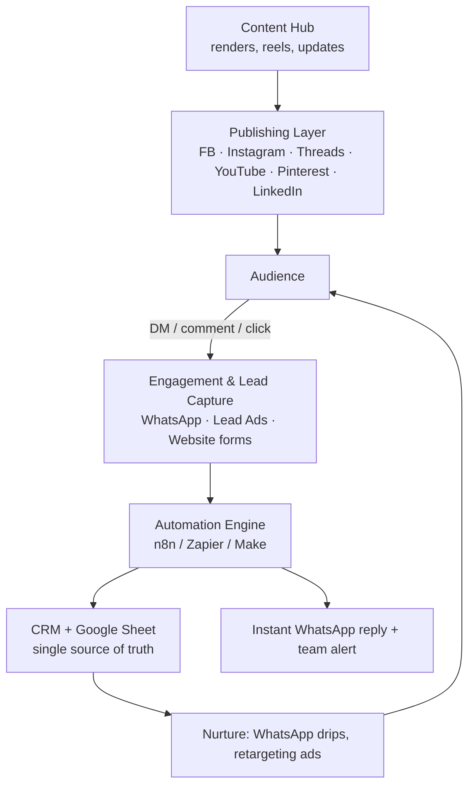

# Fab Luxe — Social Media Integration & Marketing Automation Plan

**Brand:** Fab Luxe · **Domain:** [fabluxe.co.in](https://fabluxe.co.in)
**Goal:** Connect WhatsApp, Facebook, Instagram, Threads (and YouTube, Pinterest, LinkedIn, Google) into one system that **publishes content, captures leads, and runs ads** — with automation so it mostly runs itself.
**Scope:** Organic publishing + paid advertising + lead automation.

> **Terminology note:** This plan reads *"n89"* as **n8n** (open-source workflow automation) and *"zaper"* as **Zapier**. Both are covered below, alongside **Make** and Meta's native tools, so you can choose the approach that fits your budget and technical comfort.

> **What I can and can't do:** This is the blueprint and the exact enablement checklist. Creating the accounts, verifying your business, and entering passwords/API keys/payment details must be done **by you or your team** inside each platform — I won't (and shouldn't) enter credentials on your behalf. Where a step needs that, it's marked **[you do this]**.

---

## Table of Contents

1. [The Big Picture — How It All Connects](#1-the-big-picture--how-it-all-connects)
2. [Foundation — Accounts & Assets to Set Up First](#2-foundation--accounts--assets-to-set-up-first)
3. [Platform-by-Platform Integration](#3-platform-by-platform-integration)
4. [Automation Approaches Compared (n8n vs Zapier vs Make vs Native)](#4-automation-approaches-compared)
5. [Ready-to-Build Automation Workflows](#5-ready-to-build-automation-workflows)
6. [Advertising Setup (Paid Promotion)](#6-advertising-setup-paid-promotion)
7. [Enablement Checklist — What You Must Turn On](#7-enablement-checklist--what-you-must-turn-on)
8. [Compliance & Guardrails](#8-compliance--guardrails)
9. [Rollout Roadmap (Phased)](#9-rollout-roadmap-phased)
10. [Recommended Stack & Cost Ballpark](#10-recommended-stack--cost-ballpark)

---

## 1. The Big Picture — How It All Connects

Think of it as four layers. Content flows **out**, leads flow **in**, and automation is the wiring between them.



**The core principle for real estate: speed-to-lead.** A luxury enquiry answered within 5 minutes converts far better than one answered in an hour. Automation exists mainly to make that instant, 24/7.

---

## 2. Foundation — Accounts & Assets to Set Up First

Everything else depends on this. Do it in this order.

| # | Asset | What it is / why | Who does it |
|---|---|---|---|
| 1 | **Meta Business Manager** (business.facebook.com) | The master account that owns your Page, Instagram, WhatsApp, Ads, Pixel, Catalog. Everything Meta hangs off this. | **[you do this]** |
| 2 | **Facebook Page** — "Fab Luxe" | Public brand presence + required for IG publishing, ads, and WhatsApp. | **[you do this]** |
| 3 | **Instagram Professional account** (Business type) | Switch the IG account to *Business*, then **link it to the Facebook Page** inside Business Manager. Required for the publishing API and ads. | **[you do this]** |
| 4 | **Threads profile** | Created from your Instagram account (same login). Needed for Threads API / cross-posting. | **[you do this]** |
| 5 | **WhatsApp Business** | Choose **App** (small scale) or **Platform/API** (scale + automation) — see §3. | **[you do this]** |
| 6 | **Meta Ads Manager** + payment method | Runs Facebook/Instagram/WhatsApp ads. Add a card/UPI. | **[you do this]** |
| 7 | **Meta Pixel + Conversions API (CAPI)** | Tracks website visitors for retargeting + measures ad conversions. Pixel goes on fabluxe.co.in. | Dev + **[you do this]** |
| 8 | **Product/Property Catalog** (Commerce Manager) | Powers dynamic listing ads and WhatsApp catalog. | **[you do this]** |
| 9 | **Domain verification** (fabluxe.co.in in Business Manager) | Unlocks link-edit control and improves ad trust. Add a meta tag or DNS record. | Dev |
| 10 | **Google Business Profile** | Local "map pack" presence + reviews for Greater Noida West. | **[you do this]** |
| 11 | **YouTube channel · Pinterest Business · LinkedIn Page** | Secondary channels (see §3). | **[you do this]** |

**Golden rule:** create the Instagram, WhatsApp, and Ads assets **inside Meta Business Manager**, not as loose personal accounts. Loose accounts can't be automated or advertised cleanly and are painful to migrate later.

---

## 3. Platform-by-Platform Integration

### 3.1 WhatsApp — your #1 conversion channel in India

Two very different products — pick based on scale:

| | **WhatsApp Business App** | **WhatsApp Business Platform (API)** |
|---|---|---|
| Best for | 1 person, < ~50 chats/day | A team, automation, ads-at-scale |
| Automation | Basic (quick replies, away msg) | Full — auto-replies, drips, CRM sync, chatbots |
| Broadcast | Manual, capped | Template broadcasts to opted-in lists |
| Click-to-WhatsApp ads | Limited | **Full support** |
| How to get it | Download the app | Through a **BSP** or Meta Cloud API |
| Cost | Free | Per-conversation pricing + BSP fee |

**For Fab Luxe, go with the API** (you'll run ads and want instant auto-replies). You access it two ways:

- **Meta Cloud API** (direct, hosted free by Meta) — cheapest, but developer setup + you build the dashboard.
- **A BSP (Business Solution Provider)** — a ready dashboard + easier onboarding. Popular in India: **AiSensy, Wati, Interakt, Gupshup, DoubleTick**. Most also connect to Zapier/n8n.

**What integration unlocks:**
- **Click-to-WhatsApp ads** — Facebook/Instagram ad → opens a WhatsApp chat pre-filled with a message. Best-performing real-estate lead format in India.
- **Template messages** — pre-approved marketing/utility messages you can send to opted-in contacts (brochures, site-visit reminders).
- **Catalog** — show 3/4 BHK listings inside WhatsApp.
- **24-hour window rule** — after a user messages you, you can reply freely for 24h; outside that you must use an **approved template** (see §8).

### 3.2 Facebook

- **Page** = brand home + ad-delivery surface.
- **Lead Ads / Instant Forms** — capture name/phone **without leaving Facebook**; pipe straight to CRM/WhatsApp via automation.
- **Pixel + CAPI** — retarget site visitors and video viewers.
- **Catalog / dynamic ads** — auto-show the right listing to the right person.
- **Publishing** — via Graph API (through n8n/Zapier/Make) or Meta Business Suite Planner.

### 3.3 Instagram

- Must be a **Business account linked to the Facebook Page**.
- **Content Publishing API** (via Graph API) — schedule/auto-post **feed images, carousels, and Reels**. *(Stories and some formats have API limits — a scheduler like Metricool/Publer fills the gaps.)*
- **DM automation** — auto-reply to story replies / keyword DMs (e.g. reply "PRICE" → sends brochure) via ManyChat or a BSP.
- **Reels** are the primary reach engine — prioritise them.

### 3.4 Threads

- Created from your Instagram login; same audience graph.
- **Threads API** now supports **publishing posts + replies and basic insights** — so it *can* be automated — but it's **more limited than FB/IG** (tighter rate limits, fewer formats).
- Practical approach: **auto-cross-post** your best IG/text updates to Threads via n8n/Make or a scheduler (Metricool, Buffer, and Publer support Threads). Use it for text-first commentary — market updates, "why AQI-managed living," build milestones.

### 3.5 Secondary channels (set up once, automate the cross-post)

| Channel | Role | Integration |
|---|---|---|
| **YouTube** | Walkthrough videos, SEO, trust | Data API — trigger cross-posts when a new video goes live |
| **Pinterest** | Evergreen visual search → feeds Google Images | Pinterest API / scheduler; auto-pin new renders |
| **LinkedIn** | B2B: architects, designers, investors, HNIs | LinkedIn API (via scheduler) for company-page posts |
| **Google Business Profile** | Local map presence + reviews | Post updates + automate review requests |

---

## 4. Automation Approaches Compared

This is the "different ways" you asked about. Same job, four styles:

| Approach | What it is | Cost | Technical skill | Best when | Watch-outs |
|---|---|---|---|---|---|
| **Meta Business Suite (native)** | Meta's free Planner schedules FB + IG posts | Free | Very low | You only need basic FB/IG scheduling | No WhatsApp/CRM logic; FB/IG only |
| **Zapier** | Cloud no-code; huge app library; "Zap" = trigger → actions | $$ (per-task, gets pricey at volume) | Low | Fastest to launch, non-technical team | Cost climbs with volume; data flows through Zapier's cloud |
| **Make (Integromat)** | Cloud visual builder; cheaper per operation; more logic | $ | Low–medium | More complex flows on a budget | Slightly steeper learning curve |
| **n8n** | **Open-source, self-hostable** workflow automation; you own the server + data | Free (self-host) / low (cloud) | Medium (some dev) | Scale, data ownership, many WhatsApp/CRM flows, lowest long-run cost | You maintain hosting; needs a technical person |
| **Social schedulers** (Metricool, Publer, Buffer, Later) | Purpose-built multi-platform publishing incl. **Threads** | $ | Very low | Content calendar across all channels incl. Threads/Pinterest/LinkedIn | Publishing only — not deep lead/CRM automation |
| **WhatsApp BSP dashboards** (AiSensy, Wati, Interakt) | WhatsApp broadcasts, chatbots, templates, catalog | $–$$ | Low | Running WhatsApp marketing without building it | Locked to WhatsApp; still connect to Zapier/n8n for the rest |

### How to choose (decision shortcut)

- **Small team, want it running this week, not technical →** Zapier + a scheduler (Metricool) + a WhatsApp BSP (AiSensy/Interakt).
- **Cost-conscious, some logic, still no-code →** Make instead of Zapier.
- **You have a developer, want lowest long-run cost + full data control →** **n8n** as the engine + BSP for WhatsApp + scheduler for niche channels.

You can **mix**: many brands use a scheduler for publishing, a BSP for WhatsApp, and n8n/Zapier as the glue that ties leads to the CRM.

---

## 5. Ready-to-Build Automation Workflows

Concrete recipes. Each shows **trigger → steps → recommended tool → what to enable**. Build these one at a time.

### Flow 1 — Website enquiry → instant WhatsApp + CRM + team alert
- **Trigger:** someone submits the Contact form on fabluxe.co.in
- **Steps:** ① send instant WhatsApp auto-reply ("Thanks — a Fab Luxe advisor will call shortly") → ② create CRM lead → ③ append to Google Sheet → ④ alert sales team (WhatsApp group / Slack / email)
- **Tool:** **n8n** or **Zapier** · **Enable:** website webhook, WhatsApp API, CRM API

### Flow 2 — Meta Lead Ad → 5-minute WhatsApp handoff (speed-to-lead)
- **Trigger:** new lead from a Facebook/Instagram Lead Ad
- **Steps:** ① instant WhatsApp template with brochure + booking link → ② push to CRM tagged by campaign → ③ notify the assigned advisor → ④ start a 3-message follow-up drip if no reply in 24h
- **Tool:** **Zapier/Make/n8n** (all have the "Facebook Lead Ads" trigger) · **Enable:** Lead Ads, WhatsApp API + approved template, CRM

### Flow 3 — Publish once → everywhere
- **Trigger:** you add a row/post in your content calendar (Google Sheet, Notion, or scheduler)
- **Steps:** post to **Facebook + Instagram + Threads** (+ LinkedIn + Pinterest) with the right caption/hashtags per platform
- **Tool:** **Metricool/Publer** (easiest, includes Threads) or **n8n** (full control) · **Enable:** Graph API for FB/IG, Threads API, channel APIs

### Flow 4 — New YouTube walkthrough → promote across all channels
- **Trigger:** new video published on the YouTube channel
- **Steps:** ① auto-post the link to FB, IG (link in bio update), Threads, LinkedIn → ② WhatsApp broadcast to opted-in leads → ③ create a Pinterest pin from the thumbnail
- **Tool:** **n8n** or **Zapier** · **Enable:** YouTube Data API + the channel APIs + WhatsApp broadcast

### Flow 5 — Instagram post → auto-echo to Threads & Facebook, pin to Pinterest
- **Trigger:** new IG feed post
- **Steps:** repost caption to Threads, share to the FB Page, create a Pinterest pin
- **Tool:** **Make** or **n8n** · **Enable:** IG Graph API, Threads API, Pinterest API

### Flow 6 — Site-visit booking → calendar + WhatsApp reminders
- **Trigger:** lead books a slot (Calendly/website)
- **Steps:** ① create calendar event → ② WhatsApp confirmation → ③ reminder 24h before → ④ reminder 2h before → ⑤ after-visit "thank you + feedback" message
- **Tool:** **n8n/Zapier** · **Enable:** calendar API, WhatsApp utility templates

### Flow 7 — Instagram/Story keyword → auto-send brochure
- **Trigger:** someone DMs a keyword (e.g. "3BHK") or replies to a story
- **Steps:** auto-reply with the brochure PDF + a "talk to us on WhatsApp" button → tag as a warm lead
- **Tool:** **ManyChat** or a **BSP** · **Enable:** IG messaging permissions

### Flow 8 — Post-visit review request → Google Business Profile
- **Trigger:** visit marked "completed" in CRM
- **Steps:** wait 1 day → WhatsApp asking for a Google review with the direct link → log response
- **Tool:** **n8n/Zapier** · **Enable:** CRM webhook, WhatsApp template, GBP review link

---

## 6. Advertising Setup (Paid Promotion)

### Campaign architecture for luxury real estate

```
Awareness      →  Reels / video views to a broad Greater Noida + NCR + NRI audience
Consideration  →  Traffic / engagement to walkthrough videos & listing pages
Conversion     →  Lead Ads  +  Click-to-WhatsApp ads   (the money layer)
Retargeting    →  Site visitors, video viewers, IG/FB engagers, lead look-alikes
```

**Key enablers:**
- **Click-to-WhatsApp ads** — the top real-estate format in India; ad click opens a WhatsApp chat → Flow 2 takes over.
- **Lead Ads with Instant Forms** — friction-free capture; qualify with 1–2 questions (budget, 3 vs 4 BHK).
- **Meta Pixel + Conversions API** — CAPI sends conversions server-side so tracking survives browser/iOS limits; materially improves optimisation.
- **Custom Audiences** → **Lookalikes** — upload your buyer list (hashed) to find similar HNIs; retarget site visitors and 50%+ video viewers.
- **Catalog / dynamic ads** — auto-serve the specific listing a person viewed.

**Budget tiering (illustrative, not financial advice — adjust to your numbers):** put the majority on Conversion (Lead + Click-to-WhatsApp), a slice on Retargeting (highest ROI), and a smaller Awareness budget to keep the funnel filled.

> **Note:** In India, real-estate/housing ads are **not** classified under Meta's restrictive "Special Ad Category" the way US housing is — but always follow Meta's advertising policies and never make misleading price/possession claims (also a RERA requirement).

---

## 7. Enablement Checklist — What You Must Turn On

Grouped so you can hand each group to the right person.

**A. Business & identity [you do this]**
- [ ] Meta Business Manager created; Page + IG (Business) + Threads live and **linked**
- [ ] Business verification submitted in Business Manager
- [ ] fabluxe.co.in domain verified in Business Manager
- [ ] Google Business Profile claimed & verified

**B. WhatsApp**
- [ ] Decide App vs API; if API, pick Cloud API **or** a BSP (AiSensy/Wati/Interakt/Gupshup)
- [ ] WhatsApp Business number provisioned (a fresh number is safest)
- [ ] Display name + green-tick request; **message templates** drafted & submitted for approval
- [ ] Opt-in mechanism live (see §8)

**C. Ads & tracking [dev + you]**
- [ ] Ads Manager payment method added
- [ ] Meta Pixel installed on all pages of fabluxe.co.in
- [ ] Conversions API (CAPI) configured (server-side or via partner)
- [ ] Property Catalog created in Commerce Manager
- [ ] Custom Audiences (site visitors, video viewers, customer list) defined

**D. Automation engine [dev/ops]**
- [ ] Choose Zapier / Make / **n8n** (self-host if data-control matters)
- [ ] API access + tokens generated for each platform (Graph API app, Threads API, YouTube Data API, Pinterest, LinkedIn)
- [ ] Website form → webhook wired
- [ ] CRM selected (even a Google Sheet works to start) + connected

**E. Content & compliance**
- [ ] Multi-platform content calendar (Sheet/Notion/scheduler) set up
- [ ] Privacy Policy on the site (required for Lead Ads)
- [ ] WhatsApp opt-in language + unsubscribe path defined
- [ ] (If also doing SMS) **DLT registration** for sender/templates

---

## 8. Compliance & Guardrails

- **WhatsApp opt-in is mandatory.** You may only send template/broadcast messages to people who agreed to hear from you (a form checkbox, a "message us" click, a Click-to-WhatsApp ad). No scraped/bought numbers — it gets the number banned.
- **24-hour window:** free-form replies only within 24h of the user's last message; outside it, use an **approved template**. Templates are categorised **Marketing / Utility / Authentication** and are **priced per message** — keep marketing blasts tight and relevant.
- **India DLT:** applies to **SMS** (not WhatsApp) — register sender IDs/templates if you also run SMS.
- **Meta ad policies + RERA:** no miselliing of price, area, possession date, or approvals. Show the **UP-RERA number + disclaimer** in ads and on listing pages.
- **Data privacy:** store lead data securely; honour unsubscribe/delete requests; keep a visible Privacy Policy.
- **Don't** buy followers/engagement or run "DM us, we'll spam you" tactics — it hurts reach and trust for a luxury brand.

---

## 9. Rollout Roadmap (Phased)

| Phase | Weeks | Focus | Outcome |
|---|---|---|---|
| **1 — Foundation** | 1–2 | Business Manager, Page/IG/Threads linked, WhatsApp number, Pixel + domain verify | Accounts exist and are connected |
| **2 — Organic automation** | 2–3 | Content calendar + "publish once → everywhere" (Flow 3/5), Threads cross-post | Consistent presence, minimal manual effort |
| **3 — Lead automation** | 3–5 | WhatsApp API live, Flows 1, 2, 6, 8; CRM connected | Every lead answered instantly, nothing lost |
| **4 — Paid promotion** | 5–7 | Pixel/CAPI + Lead & Click-to-WhatsApp ads + retargeting | Predictable qualified enquiries |
| **5 — Optimise** | Ongoing | Track cost-per-lead, template performance, A/B creatives | Scale what works, cut what doesn't |

---

## 10. Recommended Stack & Cost Ballpark

**My recommendation for Fab Luxe (balanced):**
- **Engine:** n8n (self-hosted) if you have a developer — lowest long-run cost + you own the lead data; otherwise **Zapier** to start fast.
- **WhatsApp:** an Indian **BSP** (AiSensy or Interakt) for the dashboard, templates, and broadcasts.
- **Publishing:** **Metricool** (covers FB, IG, Threads, Pinterest, LinkedIn, YouTube in one calendar).
- **CRM:** start with a Google Sheet or a light CRM; upgrade as volume grows.
- **Ads:** Meta Ads Manager (Lead + Click-to-WhatsApp) with Pixel + CAPI.

| Layer | Lean (start) | Scale (later) |
|---|---|---|
| Automation engine | Zapier starter | n8n self-hosted |
| WhatsApp | Interakt / AiSensy entry plan | Higher-tier BSP or direct Cloud API |
| Publishing | Metricool free/starter | Metricool/Publer paid |
| CRM | Google Sheet | HubSpot / Zoho / real-estate CRM |
| Ads | Small test budget | Scaled + retargeting |

> Platform pricing changes often — treat the above as **direction, not quotes**, and confirm current plans/limits when you set up. WhatsApp is billed per conversation/template on top of any BSP fee.

---

### Fastest path to value (if you do only three things this month)
1. **WhatsApp API + Flow 2** (Lead Ad → instant WhatsApp) — captures money-ready leads.
2. **Click-to-WhatsApp ads** with Pixel + CAPI — the best-converting paid format here.
3. **"Publish once → everywhere"** including Threads — presence without daily manual work.

*This is a marketing-operations plan, not financial or investment advice. Account creation, verification, and any credential/payment entry must be completed by your team inside each platform.*
